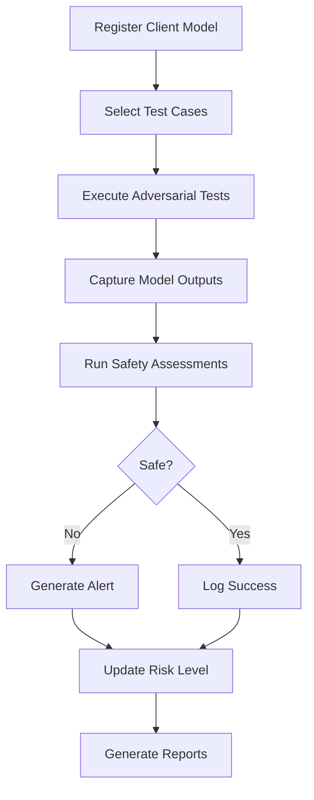

# Adversarial AI Safety Database Design

A comprehensive database schema for managing an adversarial AI safety system that tests and evaluates AI models across multiple products.

## Overview

This database serves as the **single source of truth** for an adversarial AI safety testing platform. The system:

- Manages two core products: **AI-Range** and **Nexus**
- Connects clients with products through flexible subscriptions
- Houses data from multiple AI agents and ML models
- Tests client models with adversarial prompts
- Assesses safety of model outputs
- Tracks compliance and generates alerts
- Maintains complete audit trails

## Product Architecture

The platform consists of **three interconnected layers** with AI-Range as the unified product:

### 🔝 Product Layer (Top Tier)
- **AI-Range**: Comprehensive platform - owns ALL testing, safety, persona, and scenario tables
- **Nexus**: Reserved for future use

### 🏢 Client Layer (Middle Tier)
- **Tenants**: Organizations subscribing to AI-Range
- **Subscriptions**: Managing product access, tiers, and feature flags

### 🤖 Model Layer (Bottom Tier)
- **Client Models**: AI models under test
- **Model-Product Links**: Connecting models to AI-Range

### Product Ownership Model

**AI-Range owns EVERYTHING** (all tables include `product_id` FK to AI-Range):

*Testing & Safety Operations:*
- All testing operations (`test_categories`, `test_sessions`, `test_executions`)
- Safety and compliance (`safety_assessments`, `compliance_reports`, `safety_alerts`)
### Three-Tier Architecture

**Products** → **Clients (Tenants)** → **Models**

1. **Product Layer** (Top): AI-Range (unified testing & persona platform) and Nexus (reserved)
2. **Client Layer** (Middle): Tenant organizations with product subscriptions
3. **Model Layer** (Bottom): AI models under test

**AI-Range Platform**:
- Unified Testing Hub with use cases as business context
- Adversarial testing (`adversarial_test_cases`)
- Safety assessments and compliance reporting
- Threat & Risk Framework integrated with testing
- Persona management (`personas`, `cohorts`, `sub_cohorts`)
- Persona cognition & memory (`persona_memories`, `persona_reflections`, `persona_plans`, `persona_actions`)
- Scenario generation (`scenarios`, `scenario_intents`, scenario relationships)
- Prompt generation and metadata tracking
- Audit logging (`audit_logs`)

**Key Integration**: Use cases (`use_cases`) anchor both testing activities and persona definitions within the Testing Hub

**Nexus**: Reserved for future functionality

See [Product Layer Architecture](docs/PRODUCT_LAYER_ARCHITECTURE.md) for detailed documentation.

## Features

✅ **Unified AI Testing Platform** - AI-Range provides comprehensive testing and persona-based analysis  
✅ **Integrated Testing Hub** - Use cases anchor testing and persona activities  
✅ **Product-Scoped Tables** - All 30 functional tables link to AI-Range product via `product_id`  
✅ **Threat & Risk Integration** - Threat vectors and harm categories integrated with testing framework  
✅ **Flexible Subscriptions** - Tier-based access control with usage limits  
✅ **Comprehensive Model Registry** - Track all AI agents and client models  
✅ **Adversarial Testing Framework** - Store and execute test cases  
✅ **Persona-Based Testing** - Persona generation with cognition & memory  
✅ **Scenario Framework** - Scenario generation with intent mapping  
✅ **Prompt Generation** - Integrated prompt generation and tracking  
✅ **Cat-Astrophic Integration** - Full PromptGoblin v2 system with generation runs, conversations, and LLM invocation tracking  
✅ **Safety Assessment** - Multi-agent evaluation with detailed metrics  
✅ **Alert Management** - Real-time incident tracking  
✅ **Compliance Reporting** - Automated reporting and analytics  
✅ **Complete Audit Trail** - Track all system activities  

## Database Structure

### Product & Subscription Tables

| Table | Description |
|-------|-------------|
| `products` | Available products (AI-Range primary, Nexus reserved) |
| `client_product_subscriptions` | Client subscriptions to products |
| `client_model_products` | Links models to products they use |

### AI-Range Tables (ALL Platform Functionality)

**Testing Hub (with Use Cases & Threat Framework):**

| Table | Description |
|-------|-------------|
| `use_cases` | Business use cases providing context (includes `product_id`) |
| `test_categories` | Categories of safety tests (includes `product_id`) |
| `test_sessions` | Testing sessions (includes `product_id`) |
| `adversarial_test_cases` | Library of adversarial test prompts (includes `product_id`) |
| `test_executions` | Record of each test execution (includes `product_id`) |
| `model_outputs` | Outputs from client models |
| `safety_assessments` | Safety evaluations (includes `product_id`) |
| `safety_metrics` | Detailed safety metrics |
| `safety_alerts` | Critical safety alerts |
| `compliance_reports` | Periodic compliance reports (includes `product_id`) |
| `threat_vectors` | Threat categorization framework |
| `threat_examples` | Example threats and mitigations |
| `risks` | Risk definitions |
| `harms` | Harm category definitions |
| `audit_logs` | Complete audit trail |

**Personas & Cognition:**

| Table | Description |
|-------|-------------|
| `cohorts` | User cohorts (persona classifiers) |
| `sub_cohorts` | Cohort segments (persona classifiers) |
| `personas` | Persona definitions (includes `product_id`, links to use_cases) |
| `persona_memories` | Persona memory storage (includes `product_id`) |
| `persona_reflections` | Persona reflections (includes `product_id`) |
| `persona_plans` | Persona plans (includes `product_id`) |
| `persona_actions` | Persona actions log (includes `product_id`) |
**Scenarios & Intents:**

| Table | Description |
|-------|-------------|
| `scenarios` | Test scenarios (includes `product_id`) |
| `scenario_intents` | Scenario intent breakdown (includes `product_id`) |
| `scenario_intent_personas` | Intent-persona relationships (includes `product_id`) |
| `scenario_personas` | Scenario-persona relationships (includes `product_id`) |
| `scenario_threats` | Scenario-threat relationships (includes `product_id`) |
| `scenario_scores` | Scenario scoring (includes `product_id`) |
| `scenario_test_types` | Scenario-test type relationships (includes `product_id`) |
| `intents` | User intents |
| Trait catalogs | Demographic, behavioral, psychographic traits |

**Prompt Generation:**

| Table | Description |
|-------|-------------|
| `prompt_generator_responses` | Generated prompts (includes `product_id`) |
| `prompt_response_metadata` | Prompt execution metadata (includes `product_id`) |

**Cat-Astrophic Prompt Generation (PromptGoblin v2):**

| Table | Description |
|-------|-------------|
| `generation_runs` | Batch/run-level metadata for prompt generation sessions (includes `product_id`) |
| `conversations` | Conversation-level metadata tracking (includes `product_id`) |
| `turns` | Individual prompt-response exchanges with model tracking (includes `product_id`) |
| `quality_metrics` | Quality assessment metrics for conversations (includes `product_id`) |
| `telemetry` | Aggregated metrics per generation run (includes `product_id`) |
| `llm_invocations` | LLM API invocations for auditing and cost tracking (includes `product_id`) |

### Core Shared Tables

| Table | Description |
|-------|-------------|
| `tenants` | Client organizations |
| `ai_agents` | AI agents and ML models in the system |
| `client_models` | Client models being tested |

### Views

- `vw_latest_model_assessments` - Latest assessment for each model
- `vw_model_safety_summary` - Aggregate statistics per model
- `vw_active_alerts` - Open alerts with context

## Quick Start

### 1. Deploy the Schema

```sql
-- Run the integrated schema file (PostgreSQL)
psql -d your_database -f sql/schemas/schema_integrated.sql
```

### 2. Subscribe a Client to Products

```sql
-- Create a tenant
INSERT INTO tenants (tenant_name, client_id, industry)
VALUES ('Acme Corp', 'acme-001', 'Technology');

-- Subscribe to AI-Range
INSERT INTO client_product_subscriptions (tenant_id, product_id, subscription_tier, subscription_status)
SELECT 
    t.id,
    p.id,
    'enterprise',
    'active'
FROM tenants t
CROSS JOIN products p
WHERE t.tenant_name = 'Acme Corp'
  AND p.product_code = 'ai-range';

-- Subscribe to Nexus
INSERT INTO client_product_subscriptions (tenant_id, product_id, subscription_tier, subscription_status)
SELECT 
    t.id,
    p.id,
    'premium',
    'active'
FROM tenants t
CROSS JOIN products p
WHERE t.tenant_name = 'Acme Corp'
  AND p.product_code = 'nexus';
```

### 3. Register a Client Model

```sql
-- Register model
INSERT INTO client_models (tenant_id, client_id, model_name, model_version, model_type, endpoint_url)
SELECT 
    id,
    'acme-001',
    'ChatBot',
    '1.0.0',
    'llm',
    'https://api.acme.com/chat'
FROM tenants
WHERE tenant_name = 'Acme Corp';

-- Link model to both products
INSERT INTO client_model_products (model_id, product_id, tenant_id, enabled)
SELECT 
    cm.model_id,
    p.id,
    cm.tenant_id,
    TRUE
FROM client_models cm
CROSS JOIN products p
WHERE cm.model_name = 'ChatBot'
  AND p.product_code IN ('ai-range', 'nexus');
```

### 4. Run Example Queries

```sql
-- Get all products a client uses
SELECT 
    t.tenant_name,
    p.product_code,
    cps.subscription_tier,
    cps.subscription_status
FROM client_product_subscriptions cps
JOIN tenants t ON cps.tenant_id = t.id
JOIN products p ON cps.product_id = p.id
WHERE t.tenant_name = 'Acme Corp';

-- Get safety summary for all models
SELECT * FROM vw_model_safety_summary;

-- Find models with critical issues
SELECT * FROM vw_active_alerts WHERE severity = 'critical';
```

## Documentation

| Document | Description |
|----------|-------------|
| [DOCUMENTATION.md](DOCUMENTATION.md) | Comprehensive database documentation |
| [ER_DIAGRAM.md](ER_DIAGRAM.md) | Entity relationship diagrams |
| [schema.sql](schema.sql) | Complete database schema |
| [queries.sql](queries.sql) | Sample queries and examples |

## Use Cases

### 1. Adversarial Testing
Execute adversarial tests against client models and capture outputs for evaluation.

### 2. Safety Assessment
Multi-agent evaluation system assesses model outputs for various safety criteria:
- Toxicity
- Bias
- Jailbreak attempts
- Prompt injection
- Data privacy violations

### 3. Compliance & Reporting
Generate compliance reports showing:
- Total tests executed
- Pass/fail rates
- Critical issues count
- Overall safety scores
- Trends over time

### 4. Alert Management
Automatic alert generation for:
- Critical safety failures
- Repeated violations
- Pattern detection
- Risk threshold breaches

## Technology Stack

- **Database**: Microsoft SQL Server (T-SQL)
- **Data Types**: NVARCHAR (Unicode), DATETIME2, JSON support
- **Features**: Triggers, Views, Indexes, Constraints

## Architecture Principles

1. **Single Source of Truth** - All safety data in one place
2. **Agent-Based** - All operations tracked by AI agents
3. **Auditable** - Complete audit trail of all activities
4. **Extensible** - JSON fields for future requirements
5. **Performant** - Comprehensive indexing strategy
6. **Secure** - Hashed credentials, access controls

## Example Workflow



## Key Metrics Tracked

- **Safety Score** (0-100) - Overall safety rating
- **Risk Level** - Low, Medium, High, Critical
- **Pass Rate** - Percentage of tests passed
- **Response Time** - Model performance metrics
- **Violation Types** - Specific safety issues detected

## Getting Help

For detailed information:
- Read [DOCUMENTATION.md](DOCUMENTATION.md) for complete documentation
- See [queries.sql](queries.sql) for query examples
- Review [ER_DIAGRAM.md](ER_DIAGRAM.md) for data relationships

## License

This database design is provided as-is for use in AI safety systems.

## Contributing

To extend the database:
1. Add new test categories for emerging threats
2. Create additional safety metrics
3. Add custom report types
4. Extend JSON metadata fields 
