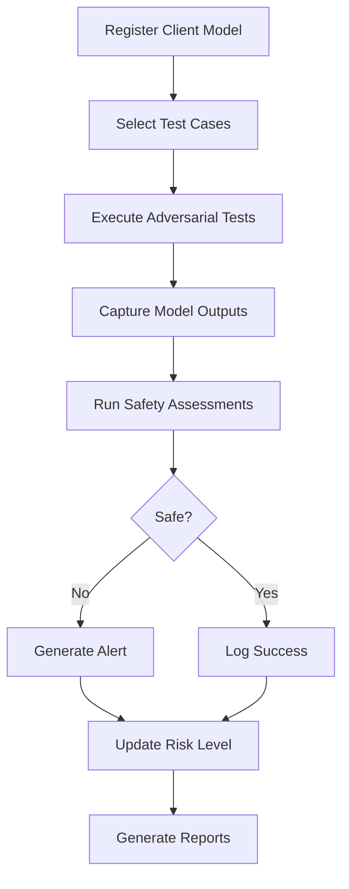

# Adversarial AI Safety Database Design

A comprehensive database schema for managing an adversarial AI safety system that tests and evaluates AI models.

## Overview

This database serves as the **single source of truth** for an adversarial AI safety testing platform. The system:

- Houses data from multiple AI agents and ML models
- Tests client models with adversarial prompts
- Assesses safety of model outputs
- Tracks compliance and generates alerts
- Maintains complete audit trails

## Features

✅ **Comprehensive Model Registry** - Track all AI agents and client models  
✅ **Adversarial Testing Framework** - Store and execute test cases  
✅ **Safety Assessment** - Multi-agent evaluation with detailed metrics  
✅ **Alert Management** - Real-time incident tracking  
✅ **Compliance Reporting** - Automated reporting and analytics  
✅ **Complete Audit Trail** - Track all system activities  

## Database Structure

### Core Tables

| Table | Description |
|-------|-------------|
| `ai_agents` | AI agents and ML models in the system |
| `client_models` | Client models being tested |
| `test_categories` | Categories of safety tests |
| `adversarial_test_cases` | Library of adversarial test prompts |
| `test_executions` | Record of each test execution |
| `model_outputs` | Outputs from client models |
| `safety_assessments` | Safety evaluations of outputs |
| `safety_metrics` | Detailed safety metrics |
| `safety_alerts` | Critical safety alerts |
| `compliance_reports` | Periodic compliance reports |
| `audit_logs` | Complete audit trail |

### Views

- `vw_latest_model_assessments` - Latest assessment for each model
- `vw_model_safety_summary` - Aggregate statistics per model
- `vw_active_alerts` - Open alerts with context

## Quick Start

### 1. Deploy the Schema

```sql
-- Run the main schema file
sqlcmd -S your_server -d your_database -i schema.sql
```

### 2. Insert Initial Data

```sql
-- Create test categories
INSERT INTO test_categories (category_name, description, severity_level)
VALUES 
    ('Jailbreak Attempts', 'Tests to bypass safety constraints', 'critical'),
    ('Toxicity Detection', 'Tests for toxic content handling', 'high'),
    ('Bias Detection', 'Tests to identify biases', 'medium');

-- Register an AI agent
INSERT INTO ai_agents (agent_name, agent_type, model_architecture, version)
VALUES ('SafetyEvaluator-v1', 'evaluator', 'GPT-4', '1.0.0');
```

### 3. Register a Client Model

```sql
INSERT INTO client_models (client_id, model_name, model_version, model_type, endpoint_url)
VALUES ('client_123', 'ChatBot', '1.0.0', 'llm', 'https://api.example.com/chat');
```

### 4. Run Example Queries

```sql
-- Get safety summary for all models
SELECT * FROM vw_model_safety_summary;

-- Find models with critical issues
SELECT * FROM vw_active_alerts WHERE severity = 'critical';
```

## Documentation

| Document | Description |
|----------|-------------|
| [DOCUMENTATION.md](DOCUMENTATION.md) | Comprehensive database documentation |
| [ER_DIAGRAM.md](ER_DIAGRAM.md) | Entity relationship diagrams |
| [schema.sql](schema.sql) | Complete database schema |
| [queries.sql](queries.sql) | Sample queries and examples |

## Use Cases

### 1. Adversarial Testing
Execute adversarial tests against client models and capture outputs for evaluation.

### 2. Safety Assessment
Multi-agent evaluation system assesses model outputs for various safety criteria:
- Toxicity
- Bias
- Jailbreak attempts
- Prompt injection
- Data privacy violations

### 3. Compliance & Reporting
Generate compliance reports showing:
- Total tests executed
- Pass/fail rates
- Critical issues count
- Overall safety scores
- Trends over time

### 4. Alert Management
Automatic alert generation for:
- Critical safety failures
- Repeated violations
- Pattern detection
- Risk threshold breaches

## Technology Stack

- **Database**: Microsoft SQL Server (T-SQL)
- **Data Types**: NVARCHAR (Unicode), DATETIME2, JSON support
- **Features**: Triggers, Views, Indexes, Constraints

## Architecture Principles

1. **Single Source of Truth** - All safety data in one place
2. **Agent-Based** - All operations tracked by AI agents
3. **Auditable** - Complete audit trail of all activities
4. **Extensible** - JSON fields for future requirements
5. **Performant** - Comprehensive indexing strategy
6. **Secure** - Hashed credentials, access controls

## Example Workflow



## Key Metrics Tracked

- **Safety Score** (0-100) - Overall safety rating
- **Risk Level** - Low, Medium, High, Critical
- **Pass Rate** - Percentage of tests passed
- **Response Time** - Model performance metrics
- **Violation Types** - Specific safety issues detected

## Getting Help

For detailed information:
- Read [DOCUMENTATION.md](DOCUMENTATION.md) for complete documentation
- See [queries.sql](queries.sql) for query examples
- Review [ER_DIAGRAM.md](ER_DIAGRAM.md) for data relationships

## License

This database design is provided as-is for use in AI safety systems.

## Contributing

To extend the database:
1. Add new test categories for emerging threats
2. Create additional safety metrics
3. Add custom report types
4. Extend JSON metadata fields 
