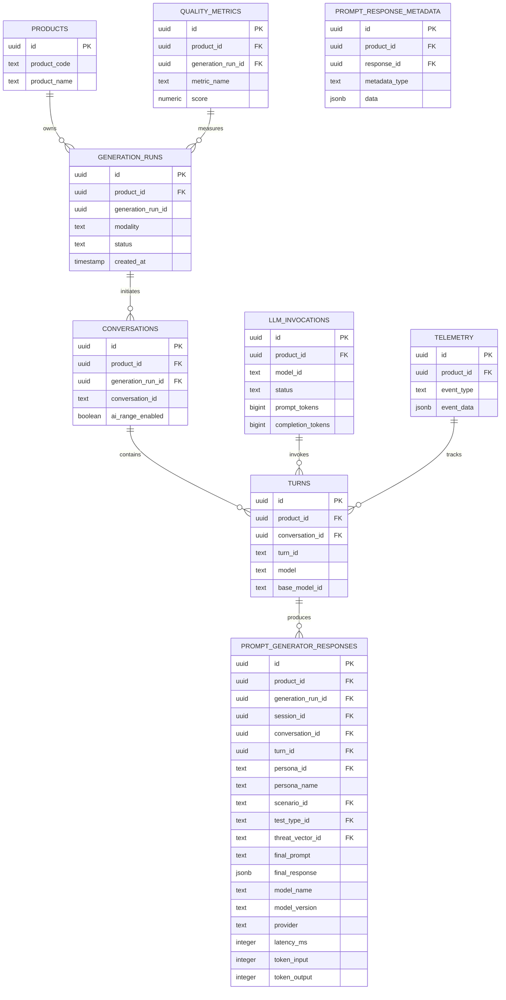
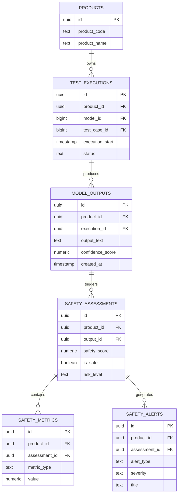
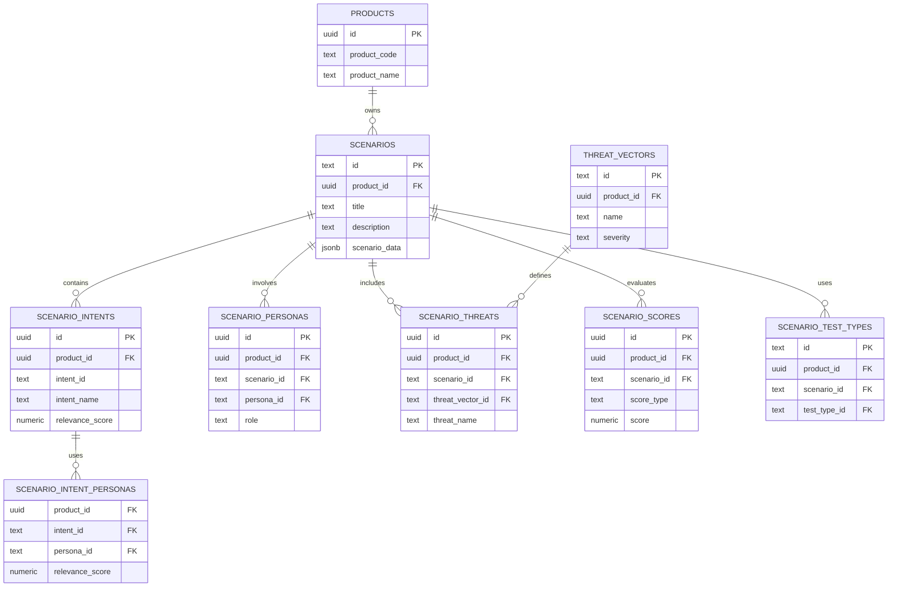
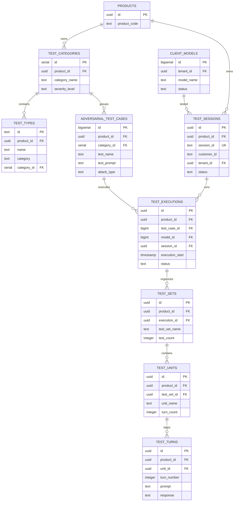
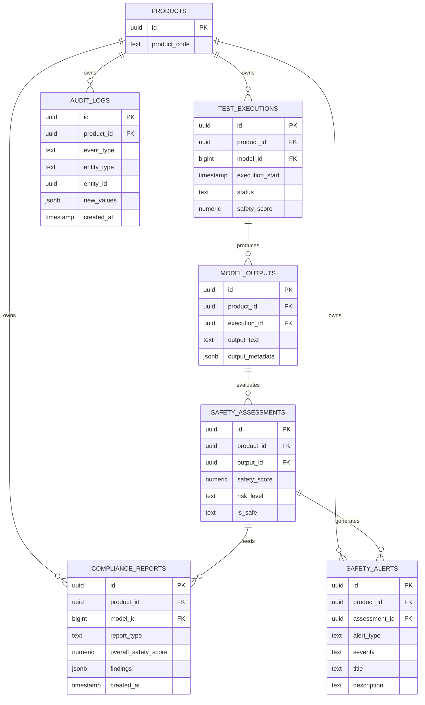
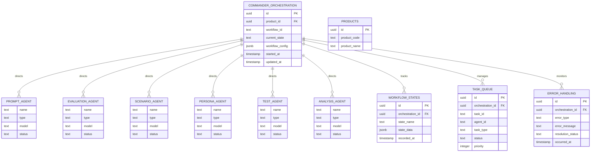
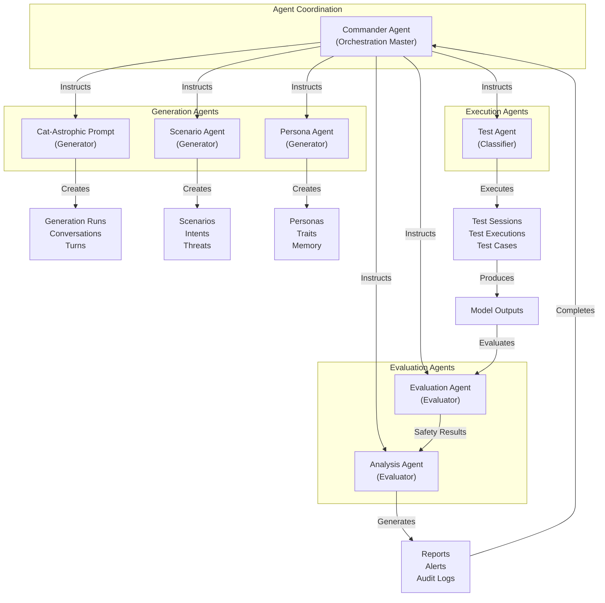

# AI-Range Agent Entity Relationship Diagrams

Each of the 7 AI-Range agents works with specific tables. Below are the ER diagrams for each agent's operational domain.

**Ground Truth Note**: All AI-Range outputs (especially Stage 4 prompts) are automatically traceable through Nexus integration via `product_prompt_lineage`, enabling cross-product lineage tracking.

---

## 1. Cat-Astrophic Prompt Agent (Generator)

**Purpose**: Generates adversarial prompts and attack scenarios
**Model**: Claude-3.5-Sonnet v2.0.0

---

## 2. Evaluation Agent (Evaluator)

**Purpose**: Evaluates model responses and safety outcomes
**Model**: GPT-4-Turbo v1.5.0

---

## 3. Scenario Agent (Generator)

**Purpose**: Creates realistic test scenarios and contextual environments
**Model**: Claude-3-Opus v1.0.0

---

## 4. Persona Agent (Generator)

**Purpose**: Generates and manages AI personas with behavioral patterns
**Model**: GPT-4 v1.2.0

```mermaid
erDiagram
    PRODUCTS ||--o{ PERSONAS : "owns"
    USE_CASES ||--o{ PERSONAS : "provides-context"
    
    PERSONAS ||--o{ PERSONA_DEMOGRAPHICS : "has"
    PERSONAS ||--o{ PERSONA_BEHAVIORAL_TRAITS : "has"
    PERSONAS ||--o{ PERSONA_PSYCHOGRAPHIC_TRAITS : "has"
    PERSONAS ||--o{ PERSONA_TECHNOGRAPHIC_TRAITS : "has"
    PERSONAS ||--o{ PERSONA_LINGUISTIC_TRAITS : "has"
    
    PERSONAS ||--o{ PERSONA_MEMORIES : "maintains"
    PERSONAS ||--o{ PERSONA_REFLECTIONS : "reflects"
    PERSONAS ||--o{ PERSONA_PLANS : "plans"
    PERSONAS ||--o{ PERSONA_ACTIONS : "executes"
    
    DEMOGRAPHIC_TRAITS_CATALOG ||--o{ PERSONA_DEMOGRAPHICS : "defines"
    BEHAVIORAL_TRAITS_CATALOG ||--o{ PERSONA_BEHAVIORAL_TRAITS : "defines"
    PSYCHOGRAPHIC_TRAITS_CATALOG ||--o{ PERSONA_PSYCHOGRAPHIC_TRAITS : "defines"
    TECHNOGRAPHIC_TRAITS_CATALOG ||--o{ PERSONA_TECHNOGRAPHIC_TRAITS : "defines"
    LINGUISTIC_TRAITS_CATALOG ||--o{ PERSONA_LINGUISTIC_TRAITS : "defines"
    
    PRODUCTS {
        uuid id PK
        text product_code
    }
    
    USE_CASES {
        uuid id PK
        uuid product_id FK
        text name
    }
    
    PERSONAS {
        text id PK
        uuid product_id FK
        uuid use_case_id FK
        text name
        text persona_type
        jsonb behavioral_profile
    }
    
    PERSONA_DEMOGRAPHICS {
        uuid id PK
        text persona_id FK
        bigint trait_id FK
        text value
    }
    
    PERSONA_BEHAVIORAL_TRAITS {
        uuid id PK
        text persona_id FK
        bigint trait_id FK
        text raw_value
        text value
    }
    
    PERSONA_PSYCHOGRAPHIC_TRAITS {
        uuid id PK
        text persona_id FK
        bigint trait_id FK
        text value
    }
    
    PERSONA_TECHNOGRAPHIC_TRAITS {
        uuid id PK
        text persona_id FK
        bigint trait_id FK
        text value
    }
    
    PERSONA_LINGUISTIC_TRAITS {
        uuid id PK
        text persona_id FK
        bigint trait_id FK
        text value
    }
    
    PERSONA_MEMORIES {
        uuid id PK
        uuid product_id FK
        text persona_id FK
        text memory_type
        jsonb memory_content
    }
    
    PERSONA_REFLECTIONS {
        uuid id PK
        uuid product_id FK
        text persona_id FK
        text reflection_text
        timestamp created_at
    }
    
    PERSONA_PLANS {
        uuid id PK
        uuid product_id FK
        text persona_id FK
        text plan_text
        jsonb plan_details
    }
    
    PERSONA_ACTIONS {
        uuid id PK
        uuid product_id FK
        text persona_id FK
        text action_type
        jsonb action_details
    }
    
    DEMOGRAPHIC_TRAITS_CATALOG {
        bigint id PK
        text key UK
        text label
    }
    
    BEHAVIORAL_TRAITS_CATALOG {
        bigint id PK
        text key UK
        text label
    }
    
    PSYCHOGRAPHIC_TRAITS_CATALOG {
        bigint id PK
        text key UK
        text label
    }
    
    TECHNOGRAPHIC_TRAITS_CATALOG {
        bigint id PK
        text key UK
        text label
    }
    
    LINGUISTIC_TRAITS_CATALOG {
        bigint id PK
        text key UK
        text label
    }
```

---

## 5. Test Agent (Classifier)

**Purpose**: Orchestrates test case execution and management
**Model**: BERT-Large v1.0.0

---

## 6. Analysis Agent (Evaluator)

**Purpose**: Analyzes results and generates compliance reports
**Model**: Claude-3-Sonnet v1.1.0

---

## 7. Commander Agent (Orchestration/Monitor)

**Purpose**: Master coordinator of all agents and workflows
**Model**: GPT-4-Turbo v2.0.0

---

## Agent Interaction Map

---

## Summary Table

| Agent | Type | Model | Primary Tables | Output |
|-------|------|-------|-----------------|--------|
| **Cat-Astrophic Prompt** | Generator | Claude-3.5-Sonnet | generation_runs, conversations, turns, prompt_generator_responses, quality_metrics | Prompt variations, attack scenarios |
| **Evaluation** | Evaluator | GPT-4-Turbo | test_executions, model_outputs, safety_assessments | Safety scores, alerts, metrics |
| **Scenario** | Generator | Claude-3-Opus | scenarios, scenario_intents, scenario_threats | Test scenarios, contexts, threat mappings |
| **Persona** | Generator | GPT-4 | personas, persona_traits, persona_memories | AI personas, behavioral profiles, memories |
| **Test** | Classifier | BERT-Large | test_categories, test_sessions, test_executions | Test runs, execution results |
| **Analysis** | Evaluator | Claude-3-Sonnet | safety_assessments, compliance_reports, audit_logs | Reports, insights, compliance data |
| **Commander** | Orchestration | GPT-4-Turbo | All tables (coordinator) | Workflow coordination, state management |
