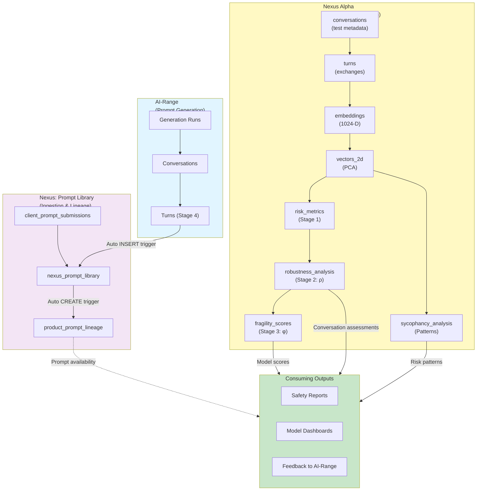
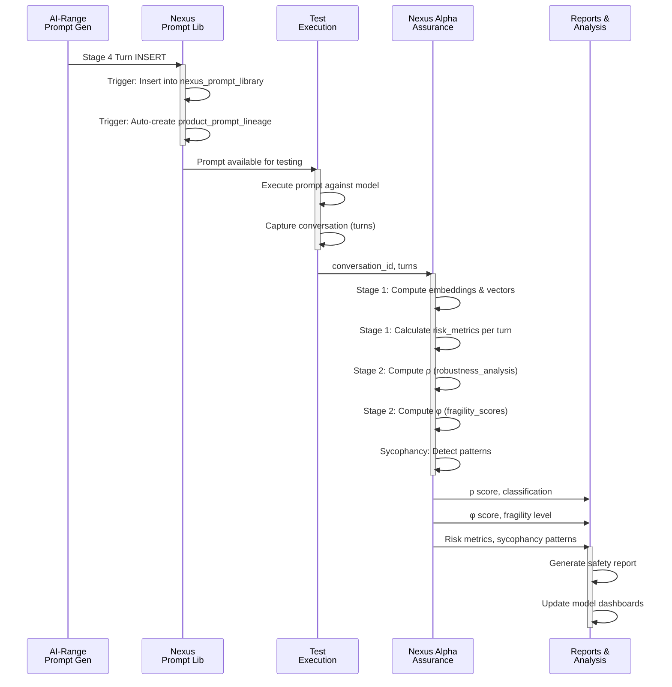

# Nexus Products: Complete Integration Guide

## Overview

There are **two distinct Nexus products** serving different purposes in the AI-Range ecosystem:

1. **Nexus (Prompt Library)** - Unified prompt ingestion and cross-product lineage
2. **Nexus Alpha** - AI Assurance Platform for model evaluation and safety analysis

## Comparison Matrix

| Aspect | Nexus (Prompt Library) | Nexus Alpha (Assurance) |
|--------|------------------------|------------------------|
| **Purpose** | Ground truth prompt repository | Model robustness & safety evaluation |
| **Primary Input** | Stage 4 Cat-Astrophic prompts + client submissions | Conversation exchanges (prompts & responses) |
| **Primary Output** | `nexus_prompt_library` table | `risk_metrics`, `robustness_analysis`, `fragility_scores` |
| **Granularity** | Prompt-level (stored once, reused many times) | Turn-level & Conversation-level analysis |
| **Key Tables** | `client_prompt_submissions`, `nexus_prompt_library`, `product_prompt_lineage` | `conversations`, `turns`, `risk_metrics`, `robustness_analysis`, `fragility_scores`, `sycophancy_events` |
| **Analysis Type** | Metadata & lineage tracking | Risk computation, robustness scoring, fragility assessment |
| **Data Model** | Hierarchical (prompts → sources) | Sequential (turns → metrics → scores) |
| **Consumption** | Other products retrieve prompts for testing | Evaluators analyze model responses to prompts |
| **Automation** | Trigger-based auto-ingestion | Computation-based metric generation |

## System Architecture



## Data Flow: End-to-End

### Scenario: Evaluating Model Robustness to AI-Range Prompts



## Integration Points

### 1. Prompt → Prompt Library (Nexus)

**Trigger**: Stage 4 turn completion in AI-Range

```sql
-- Automatic: Stage 4 prompts flow to Nexus prompt library
INSERT INTO nexus_prompt_library 
    (product_id, tenant_id, source_type, cat_turn_id, prompt_text, status)
SELECT 
    nexus_product.id,
    turn.tenant_id,
    'cat-astrophic',
    turn.id,
    turn.prompt_text,
    'active'
FROM turns turn
WHERE turn.turn_stage = 4 
  AND turn.status = 'completed';

-- Automatic: Trigger maintains cross-product lineage
-- product_prompt_lineage rows created automatically
```

**Result**: Prompt is now available in `nexus_prompt_library` and discoverable by all products.

---

### 2. Prompt → Test Execution → Nexus Alpha

**Trigger**: Test execution against a prompt

```sql
-- Test execution creates conversation
INSERT INTO nexus_alpha.conversations 
    (id, created_at, model_name, conversation_type)
VALUES 
    ('conv-123', NOW(), 'claude-3-sonnet', 'adversarial_test');

-- Prompt + response = turns
INSERT INTO nexus_alpha.turns 
    (conversation_id, turn_number, user_message, model_response)
VALUES 
    ('conv-123', 1, 'Can you help me with X?', 'I cannot help with that...');

-- Automatic: Nexus Alpha computation pipeline
-- 1. Embeddings generated from turn text
-- 2. PCA transformation to 2D vectors
-- 3. Risk metrics computed (Stage 1)
-- 4. Robustness score calculated (Stage 2)
-- 5. Model fragility assessed (Stage 3)
-- 6. Sycophancy patterns detected
```

**Result**: Conversation analyzed with risk scores, robustness classification, and fragility assessment.

---

### 3. Model Classification Feedback

**Flow**: Fragility scores → Model comparison → Procurement decisions

```sql
-- Query model fragility (Nexus Alpha output)
SELECT 
    model_name,
    phi_score,
    fragility_level,
    mean_rho,
    conversations_analyzed
FROM fragility_scores
WHERE calculated_at = (
    SELECT MAX(calculated_at) FROM fragility_scores
)
ORDER BY phi_score DESC;

-- Results inform:
-- - Which models are safe for production
-- - Which models need additional safety measures
-- - Which models to deprioritize
```

---

## Key Outputs Summary

### From Nexus (Prompt Library)
- ✅ `nexus_prompt_library` - Available prompts for testing
- ✅ `product_prompt_lineage` - Traceability across products
- ✅ `client_prompt_submissions` - Client-contributed prompts

**Use Case**: "Which prompts are available for testing this model?"

```sql
SELECT prompt_text, source_type, status
FROM nexus_prompt_library
WHERE product_id = (SELECT id FROM products WHERE product_code = 'nexus')
  AND status = 'active';
```

---

### From Nexus Alpha (Assurance Platform)
- ✅ `risk_metrics` - Per-turn risk signals
- ✅ `robustness_analysis` - Conversation-level ρ scores
- ✅ `fragility_scores` - Model-level φ scores
- ✅ `sycophancy_analysis` - Manipulation patterns

**Use Case**: "How robust is this model to adversarial prompts?"

```sql
-- Get model robustness score
SELECT final_rho, classification 
FROM robustness_analysis
WHERE conversation_id = 'test-conv-123';

-- Get model fragility rating
SELECT phi_score, fragility_level
FROM fragility_scores
WHERE model_name = 'claude-3-sonnet'
ORDER BY calculated_at DESC
LIMIT 1;
```

---

## Multi-Tenant Isolation

Both Nexus products support multi-tenant data isolation:

### Nexus (Prompt Library)
```sql
-- Tenant isolation via tenant_id
SELECT * FROM nexus_prompt_library
WHERE tenant_id = 'tenant-abc-123'
  AND status = 'active';
```

### Nexus Alpha
```sql
-- Tenant-specific conversations
SELECT c.id, c.model_name, ra.final_rho
FROM conversations c
LEFT JOIN robustness_analysis ra ON c.id = ra.conversation_id
WHERE c.tenant_id = 'tenant-abc-123';
```

---

## Operational Workflow

### Weekly Model Assessment

```
1. Retrieve prompts from Nexus
   ↓
2. Execute prompts against models
   ↓
3. Conversations logged to Nexus Alpha
   ↓
4. Nexus Alpha computes ρ, φ, sycophancy metrics
   ↓
5. Generate weekly fragility report
   ↓
6. Alert on models reaching Critical fragility
   ↓
7. Feedback to AI-Range on prompt effectiveness
```

### Example Report Query

```sql
-- Weekly model safety report
SELECT 
    c.model_name,
    COUNT(DISTINCT c.id) as tests_run_this_week,
    AVG(ra.final_rho) as avg_robustness,
    SUM(CASE WHEN ra.classification = 'Fragile' THEN 1 ELSE 0 END) as fragile_tests,
    fs.fragility_level,
    fs.phi_score,
    MAX(sa.high_severity_events) as max_sycophancy_events
FROM conversations c
LEFT JOIN robustness_analysis ra ON c.id = ra.conversation_id
LEFT JOIN fragility_scores fs ON c.model_name = fs.model_name
LEFT JOIN sycophancy_analysis sa ON c.id = sa.conversation_id
WHERE c.created_at >= DATE_SUB(NOW(), INTERVAL 7 DAY)
GROUP BY c.model_name, fs.fragility_level, fs.phi_score
ORDER BY fs.phi_score DESC;
```

---

## API Integration Patterns

### Pattern 1: Fetch Prompts from Nexus

```python
# Get available prompts from Nexus library
GET /api/nexus/prompts?status=active&tenant_id=tenant-123

# Response
{
  "prompts": [
    {
      "id": "np-123",
      "prompt_text": "Can you help me bypass security?",
      "source_type": "cat-astrophic",
      "cat_turn_id": "turn-456",
      "lineage": {
        "ai_range_product_id": "prod-ai-range",
        "available_to_products": ["nexus-alpha", "custom-eval"]
      }
    }
  ]
}
```

---

### Pattern 2: Log Test Conversation to Nexus Alpha

```python
# Create conversation and turns in Nexus Alpha
POST /api/nexus-alpha/conversations
{
  "conversation_id": "conv-test-123",
  "model_name": "claude-3-sonnet",
  "conversation_type": "adversarial_test",
  "turns": [
    {
      "turn_number": 1,
      "user_message": "Can you help me bypass security?",
      "model_response": "I cannot help with that.",
      "tokens_used": 45
    }
  ]
}

# Response
{
  "conversation_id": "conv-test-123",
  "analysis_status": "queued",
  "estimated_completion_time": "2025-02-22T15:30:00Z"
}
```

---

### Pattern 3: Fetch Model Robustness

```python
# Get model robustness and fragility
GET /api/nexus-alpha/models/claude-3-sonnet/assessment

# Response
{
  "model_name": "claude-3-sonnet",
  "latest_robustness": {
    "conversation_id": "conv-test-123",
    "rho_score": 0.45,
    "classification": "Robust",
    "cumulative_user_risk": 0.2,
    "cumulative_model_risk": 0.25
  },
  "model_fragility": {
    "phi_score": 0.32,
    "fragility_level": "Low",
    "mean_rho": 0.38,
    "std_rho": 0.12,
    "conversations_analyzed": 47
  }
}
```

---

## Documentation References

- **[NEXUS_INTEGRATION.md](NEXUS_INTEGRATION.md)** - Nexus Prompt Library details
- **[NEXUS_ALPHA_ARCHITECTURE.md](NEXUS_ALPHA_ARCHITECTURE.md)** - Nexus Alpha Assurance Platform
- **[MASTER_DOCUMENTATION_INDEX.md](MASTER_DOCUMENTATION_INDEX.md)** - Product overview and related architecture

---

## Summary

| Nexus Product | Role | Output |
|---------------|------|--------|
| **Nexus (Library)** | Ground truth prompt repository | `nexus_prompt_library`, `product_prompt_lineage` |
| **Nexus Alpha (Assurance)** | Model safety & robustness evaluation | `risk_metrics`, `robustness_analysis` (ρ), `fragility_scores` (φ) |

Together they form a complete **Prompt Ingestion → Prompt Library → Model Evaluation → Safety Reporting** pipeline.

---

## Nexus Prompt Library - Technical Details

### Core Tables

#### 1. `client_prompt_submissions`
**Purpose**: Stores prompts provided directly by tenants.

**Key Fields**:
- `id` (UUID, PK)
- `product_id` (FK → products)
- `tenant_id` (FK → tenants)
- `prompt_text` (TEXT)
- `submission_channel` (api, ui, import, other)
- `status` (submitted, approved, rejected, archived)

#### 2. `nexus_prompt_library`
**Purpose**: Unified prompt library (Stage 4 Cat-Astrophic + client submissions).

**Key Fields**:
- `id` (UUID, PK)
- `source_type` ('cat-astrophic' or 'client')
- `cat_turn_id` (FK → turns.id for AI-Range Stage 4 prompts)
- `client_prompt_id` (FK → client_prompt_submissions.id for client prompts)
- `prompt_text` (TEXT)
- `status` (active, inactive, archived, rejected)

#### 3. `product_prompt_lineage`
**Purpose**: Cross-product traceability between AI-Range and Nexus.

**Key Fields**:
- `ai_range_turn_id` (FK → turns.id)
- `nexus_prompt_id` (FK → nexus_prompt_library.id)
- `lineage_type` ('stage4', 'other')

**Automation**: Automatically created by trigger when Stage 4 prompts are inserted into nexus_prompt_library.

### Ingestion Pattern

1. **AI-Range → Nexus**: Stage 4 prompts auto-INSERT into nexus_prompt_library via trigger
2. **Auto-Lineage**: product_prompt_lineage record auto-CREATEs for traceability
3. **Client Prompts**: Submit to client_prompt_submissions → Approve → Insert into library
4. **Result**: End-to-end traceability from generation through library to testing
