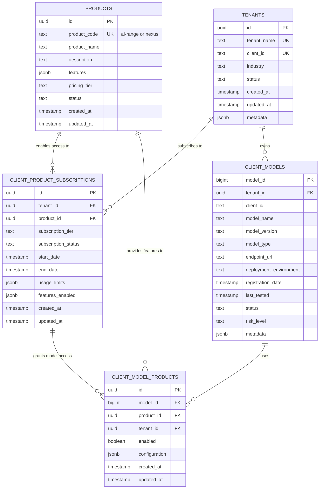

# Product Layer Entity Relationship Diagram

## Three-Tier Architecture: Products → Clients → Models



## Key Relationships

1. **PRODUCTS → CLIENT_PRODUCT_SUBSCRIPTIONS**: Products enable subscriptions for clients
2. **TENANTS → CLIENT_PRODUCT_SUBSCRIPTIONS**: Clients subscribe to products with specific tiers and features
3. **TENANTS → CLIENT_MODELS**: Clients own AI models that need testing
4. **CLIENT_MODELS → CLIENT_MODEL_PRODUCTS**: Models are linked to specific products
5. **PRODUCTS → CLIENT_MODEL_PRODUCTS**: Products provide features to models
6. **CLIENT_PRODUCT_SUBSCRIPTIONS → CLIENT_MODEL_PRODUCTS**: Subscriptions grant model-level access

## Architecture Flow

```
┌──────────────┐
│   PRODUCTS   │  (ai-range, nexus)
└──────┬───────┘
       │
       ├─────────────────────────────────┐
       │                                 │
       ▼                                 ▼
┌─────────────────────────┐    ┌────────────────────┐
│ CLIENT_PRODUCT_         │    │ CLIENT_MODEL_      │
│ SUBSCRIPTIONS           │───>│ PRODUCTS           │
│ (Access Management)     │    │ (Model-Product     │
└────────┬────────────────┘    │  Linking)          │
         │                     └─────┬──────────────┘
         │                           │
         │                           │
         ▼                           ▼
    ┌─────────┐               ┌──────────────┐
    │ TENANTS │──────────────>│CLIENT_MODELS │
    └─────────┘               └──────────────┘
     (Clients)                 (AI Models)
```

## Example Data Flow

### Scenario: Acme Corp subscribes to both products

1. **Create Tenant**
   - Acme Corp registered in `TENANTS`

2. **Subscribe to Products**
   - Entry in `CLIENT_PRODUCT_SUBSCRIPTIONS` for ai-range
   - Entry in `CLIENT_PRODUCT_SUBSCRIPTIONS` for nexus

3. **Register Model**
   - AcmeChat-Assistant added to `CLIENT_MODELS`

4. **Link Model to Products**
   - Entry in `CLIENT_MODEL_PRODUCTS` linking model to ai-range
   - Entry in `CLIENT_MODEL_PRODUCTS` linking model to nexus

## Product Codes

- **ai-range**: Comprehensive AI testing and safety assessment
- **nexus**: Advanced AI persona testing and risk analysis
