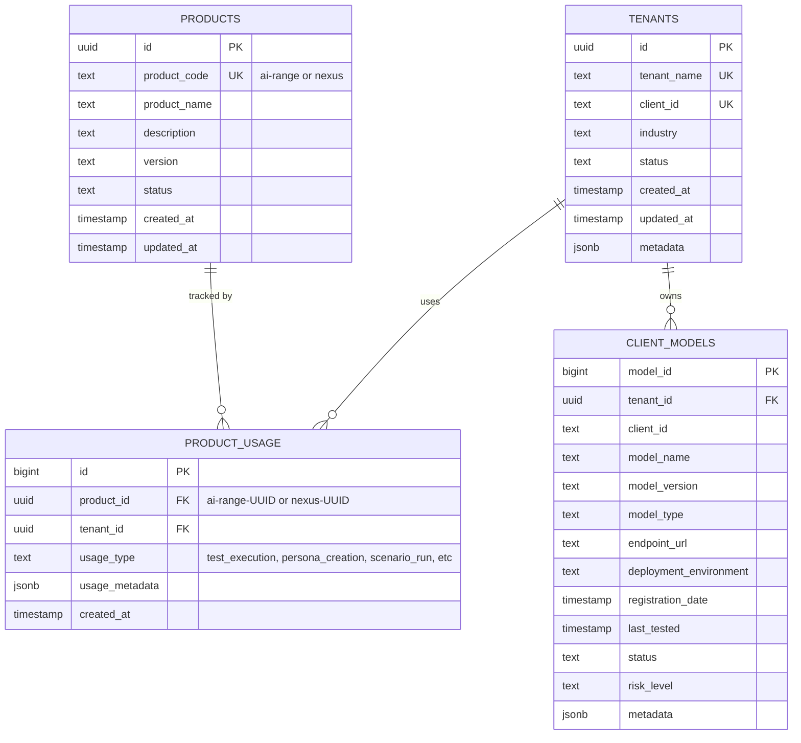

# Product Layer Entity Relationship Diagram

## Two-Tier Architecture: Clients → Models



## Key Relationships

1. **PRODUCTS**: Defines AI-Range (unified testing, personas, risk analysis) and Nexus (prompt ingestion) products
2. **PRODUCTS → PRODUCT_USAGE**: Tracks each use of a product by a tenant
3. **TENANTS**: Client organizations using AI-Range and Nexus
4. **TENANTS → PRODUCT_USAGE**: Each tenant usage event is recorded
5. **TENANTS → CLIENT_MODELS**: Clients own AI models that need testing

## Architecture Flow

```
┌──────────────────────────────────────────────────┐
│ PRODUCTS (AI-Range, Nexus)                       │
│ - Unified testing platform                      │
│ - Persona testing                               │
│ - Risk analysis                                 │
└──────────────┬───────────────────────────────────┘
               │ tracks usage via
               ▼
┌──────────────────────────────────────────────────┐
│ PRODUCT_USAGE (Usage Events)                    │
│ - Each product use recorded                     │
│ - FK: product_id (ai-range or nexus)           │
│ - FK: tenant_id                                 │
│ - Usage type (test, persona, scenario, etc)    │
└──────────────┬───────────────────────────────────┘
               │
               ▼
┌──────────────────────────────────────────────────┐
│ TENANTS (Client Organizations)                  │
│ - Tenant isolation                              │
│ - Central management                            │
└──────────────┬───────────────────────────────────┘
               │
               ▼
┌──────────────────────────────────────────────────┐
│ CLIENT_MODELS (AI Models Under Test)            │
│ - Model registration                            │
│ - Testing capability                            │
└──────────────────────────────────────────────────┘
```

## Example: Onboarding Acme Corp

1. **Create Tenant**: New TENANTS entry for Acme Corp
2. **Register Model**: AcmeChat-Assistant added to CLIENT_MODELS  
3. **Start Testing**: Tenant can immediately use AI-Range
4. **Access**: All AI-Range features available (testing, personas, risk analysis)

## Product Codes

- **ai-range**: Comprehensive AI testing, persona testing, and risk analysis
- **nexus**: Prompt ingestion + library for persona/scenario testing

## Data Model Notes

### Products Table
- Versioning support (version column)
- Timestamp tracking (created_at, updated_at)
- Status management (active, inactive, retired)
- Two products: AI-Range (primary) and Nexus (prompt ingestion + library)

### Product Usage Table
- **Tracks every use of a product by a tenant**
- `product_id` (FK) - Points to AI-Range or Nexus product UUID
- `tenant_id` (FK) - Which tenant used the product
- `usage_type` (varchar) - Type of usage event (test_execution, persona_creation, scenario_run, prompt_generation, safety_assessment, compliance_report, etc.)
- `usage_metadata` (JSONB) - Additional context (test_id, persona_id, execution_time, etc.)
- `created_at` (timestamp) - When the usage occurred
- Enables: Usage tracking, billing, feature analytics, compliance auditing

### Tenants Table
- Unique client identification (tenant_name, client_id)
- Industry classification for reporting
- Status tracking (active, inactive, suspended)
- Flexible metadata via JSONB

### Client Models Table
- Multi-tenant isolation via tenant_id
- Model versioning and environment tracking
- Risk assessment fields
- Last tested timestamp for auditing
- Flexible configuration via JSONB metadata

## Query Examples

### Track product usage for a tenant
```sql
SELECT pu.usage_type, COUNT(*) as count, MAX(pu.created_at) as last_used
FROM product_usage pu
WHERE pu.tenant_id = $1 AND pu.product_id = $2
GROUP BY pu.usage_type
ORDER BY count DESC;
```

### Get all AI-Range usage in date range
```sql
SELECT t.tenant_name, pu.usage_type, COUNT(*) as usage_count
FROM product_usage pu
JOIN tenants t ON pu.tenant_id = t.id
JOIN products p ON pu.product_id = p.id
WHERE p.product_code = 'ai-range'
  AND pu.created_at BETWEEN $1 AND $2
GROUP BY t.id, pu.usage_type
ORDER BY usage_count DESC;
```

### Get all models for a tenant
```sql
SELECT cm.model_name, cm.model_version, cm.status
FROM client_models cm
WHERE cm.tenant_id = $1
ORDER BY cm.registration_date DESC;
```

### Get tenant with model count and product usage
```sql
SELECT t.tenant_name, 
       COUNT(DISTINCT cm.model_id) as model_count,
       COUNT(DISTINCT pu.id) as usage_events
FROM tenants t
LEFT JOIN client_models cm ON t.id = cm.tenant_id
LEFT JOIN product_usage pu ON t.id = pu.tenant_id
WHERE t.status = 'active'
GROUP BY t.id;
```

### Get all products with versioning
```sql
SELECT product_code, product_name, version, status, updated_at
FROM products
ORDER BY product_code, version DESC;
```
