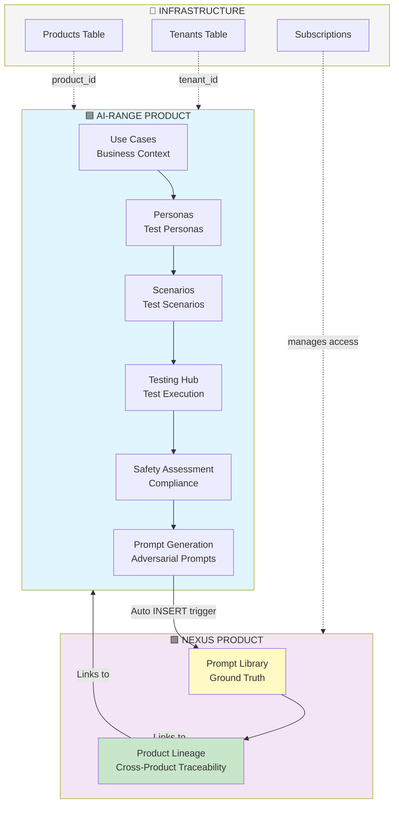
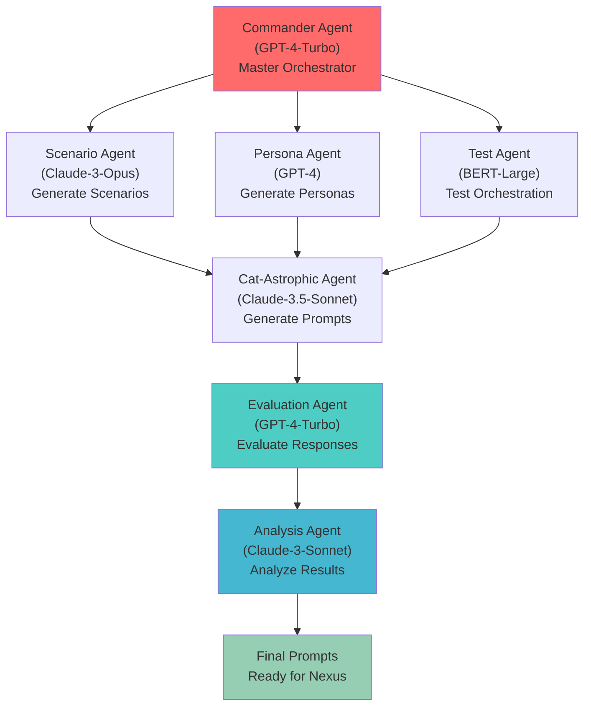
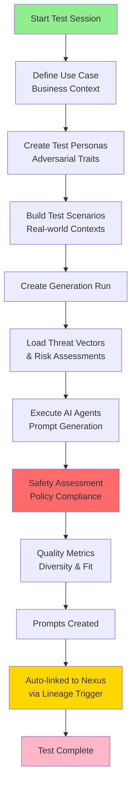
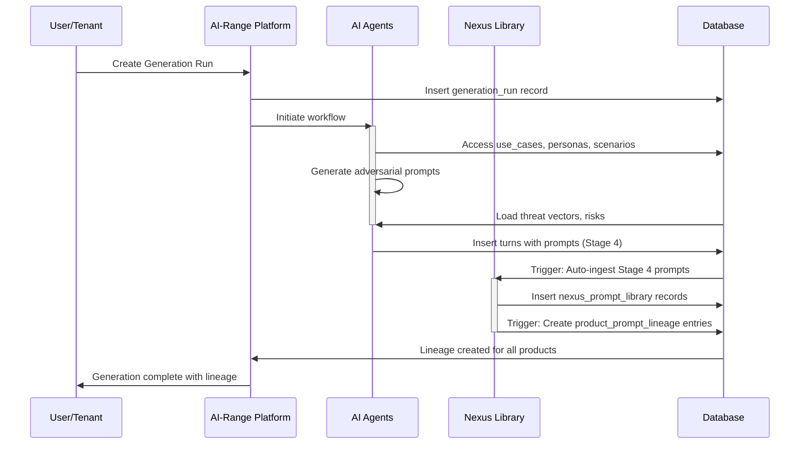

# Archived: AI-Range & Nexus Unified Platform - Final Architecture

**ARCHIVED SNAPSHOT**: Historical unified platform overview.  
For current platform documentation, see root-level `DOCUMENTATION.md` and component-specific docs in `docs/` folder.

This file has been archived and consolidated into the canonical documentation.

See the canonical documents:
- `DOCUMENTATION.md` (master reference)
- `MASTER_DOCUMENTATION_INDEX.md` (navigation)
- `docs/NEXUS_PRODUCTS_INTEGRATION.md` (product comparison)

Archived copy (full content preserved): `docs/archive/AI-Range & Nexus Unified Platform .md`

## Complete List of Tables with product_id

All operational tables now include `product_id UUID NOT NULL REFERENCES products(id)` linking to AI-Range or Nexus. The database currently contains **75 tables** implementing the unified platform architecture:

### Product & Tenant Management (4 tables)
1. ✅ `products` - Platform products (AI-Range, Nexus)
2. ✅ `product_usage` - Product usage tracking for billing and analytics
3. ✅ `tenants` - Client organizations
4. ✅ `client_product_subscriptions` - Product subscription management

### AI Agents (1 table)
5. ✅ `ai_agents` - Testing and evaluation agents

### Client Model Management (2 tables)
6. ✅ `client_models` - Client AI models under test
7. ✅ `client_model_products` - Model-to-product associations

### Use Cases (1 table)
8. ✅ `use_cases` - Business use cases for testing and personas

### Cohorts & Traits (11 tables)
9. ✅ `cohorts` - Persona cohort classifications
10. ✅ `sub_cohorts` - Persona sub-cohort classifications
11. ✅ `demographic_traits_catalog` - Demographic trait definitions
12. ✅ `behavioral_traits_catalog` - Behavioral trait definitions
13. ✅ `psychographic_traits_catalog` - Psychographic trait definitions
14. ✅ `technographic_traits_catalog` - Technographic trait definitions
15. ✅ `linguistic_traits_catalog` - Linguistic trait definitions
16. ✅ `persona_demographics` - Persona demographic assignments
17. ✅ `persona_behavioral_traits` - Persona behavioral assignments
18. ✅ `persona_psychographic_traits` - Persona psychographic assignments
19. ✅ `persona_technographic_traits` - Persona technographic assignments
20. ✅ `persona_linguistic_traits` - Persona linguistic assignments

### Personas & Memory (6 tables)
21. ✅ `personas` - AI personas for testing
22. ✅ `persona_memories` - Persona memory storage
23. ✅ `persona_reflections` - Persona reflections
24. ✅ `persona_plans` - Persona plans and goals
25. ✅ `persona_actions` - Persona actions taken
26. ✅ `context_profiles` - Customer context for testing

### Threats, Risks & Harms (7 tables)
27. ✅ `risk_assessments` - Risk assessment results
28. ✅ `threat_vectors` - Threat intelligence vectors
29. ✅ `threat_examples` - Examples of threats
30. ✅ `risks` - Risk definitions
31. ✅ `harms` - Harm definitions

### Testing Framework (8 tables)
32. ✅ `test_categories` - Test categorization framework
33. ✅ `test_types` - Types of tests available
34. ✅ `test_sessions` - Testing sessions for tenants
35. ✅ `adversarial_test_cases` - Individual adversarial test cases
36. ✅ `test_executions` - Test execution records
37. ✅ `test_sets` - Test set groupings
38. ✅ `test_units` - Test unit definitions
39. ✅ `test_turns` - Individual test turns

### Scenarios & Intents (7 tables)
40. ✅ `scenarios` - Test scenarios
41. ✅ `scenario_intents` - Intents within scenarios
42. ✅ `scenario_intent_personas` - Personas for each intent
43. ✅ `scenario_personas` - Personas in scenarios
44. ✅ `scenario_threats` - Threats in scenarios
45. ✅ `scenario_scores` - Scenario evaluation scores
46. ✅ `scenario_test_types` - Test types for scenarios

### Model & Response Tracking (2 tables)
47. ✅ `model_outputs` - Model responses from tests
48. ✅ `model_response_cache` - Cache for model responses

### Prompt Generation (6 tables)
49. ✅ `prompt_generator_responses` - Generated responses with metadata
50. ✅ `generation_runs` - Batch prompt generation sessions
51. ✅ `conversations` - Conversation threads
52. ✅ `turns` - Individual conversation turns (includes Stage 4)
53. ✅ `quality_metrics` - Quality metrics for generation
54. ✅ `telemetry` - System telemetry data

### Agent Interactions & Workflow (7 tables)
55. ✅ `agent_interactions` - Core agent participation in generation runs
56. ✅ `agent_interaction_libraries` - Library access tracking (personas, scenarios, test cases, threats, risks, harms)
57. ✅ `agent_interaction_inputs` - Input parameters for each agent interaction
58. ✅ `agent_interaction_outputs` - Output data generated by agents
59. ✅ `agent_interaction_flow` - Data flow between agents in workflow
60. ✅ `agent_interaction_decisions` - Decision points and branches in workflows
61. ✅ `agent_interaction_metrics` - Performance and quality metrics per interaction

### Safety & Compliance (7 tables)
62. ✅ `safety_assessments` - Safety evaluation results
63. ✅ `safety_metrics` - Safety metrics and scores
64. ✅ `ai_test_results` - AI test results
65. ✅ `nyc_test_results` - NYC regulation test results
66. ✅ `safety_alerts` - Safety alert notifications
67. ✅ `compliance_reports` - Compliance assessment reports
68. ✅ `audit_logs` - System audit trail

### Nexus Ground Truth (3 tables)
69. ✅ `client_prompt_submissions` - Client-provided prompts
70. ✅ `nexus_prompt_library` - Unified prompt library (Stage 4 + client)
71. ✅ `product_prompt_lineage` - Cross-product lineage (auto-maintained)

### Data Sources & Utilities (4 tables)
72. ✅ `sources` - Data source definitions
73. ✅ `crawls` - Data crawl operations
74. ✅ `raw_items` - Raw data items
75. ✅ `scenario_seeds` - Scenario seed data

## Architecture Diagram



---

## AI-Range Core Agents (7 Agents)

AI-Range is powered by 7 specialized agents that work in concert to orchestrate all testing operations:

| Agent | Type | Model | Purpose |
|-------|------|-------|---------|
| **Cat-Astrophic Prompt Agent** | Generator | Claude-3.5-Sonnet | Generates adversarial prompts and attack scenarios |
| **Evaluation Agent** | Evaluator | GPT-4-Turbo | Evaluates responses and safety outcomes |
| **Scenario Agent** | Generator | Claude-3-Opus | Creates realistic test scenarios and contexts |
| **Persona Agent** | Generator | GPT-4 | Generates personas with behavioral patterns |
| **Test Agent** | Classifier | BERT-Large | Orchestrates test execution and management |
| **Analysis Agent** | Evaluator | Claude-3-Sonnet | Analyzes results and generates reports |
| **Commander Agent** | Orchestration | GPT-4-Turbo | Master coordinator of all agents and workflows |

### Agent Workflow



---

## SQL Examples

### Creating a Test with Persona

```sql
-- Everything references ai-range product
INSERT INTO use_cases (product_id, name, slug)
SELECT id, 'Customer Support', 'customer-support'
FROM products WHERE product_code = 'ai-range';

INSERT INTO personas (product_id, tenant_id, use_case_id, name, persona_type)
SELECT 
    p.id,
    't-123',
    uc.id,
    'Angry Customer',
    'adversarial'
FROM products p
CROSS JOIN use_cases uc
WHERE p.product_code = 'ai-range'
  AND uc.slug = 'customer-support';

INSERT INTO scenarios (product_id, tenant_id, persona_id, title)
SELECT 
    p.id,
    't-123',
    per.id,
    'Escalated Complaint'
FROM products p
CROSS JOIN personas per
WHERE p.product_code = 'ai-range'
  AND per.name = 'Angry Customer';
```

### Get All AI-Range Operations

```sql
-- All operations are AI-Range operations
SELECT 'test_execution' as type, execution_id::text as id, execution_start as ts
FROM test_executions te
JOIN products p ON te.product_id = p.id
WHERE p.product_code = 'ai-range'

UNION ALL

SELECT 'persona', id, created_at
FROM personas per
JOIN products p ON per.product_id = p.id
WHERE p.product_code = 'ai-range'

UNION ALL

SELECT 'scenario', id, created_at
FROM scenarios s
JOIN products p ON s.product_id = p.id
WHERE p.product_code = 'ai-range'

ORDER BY ts DESC;
```

## Benefits of Unified Platform

### 1. **Simplified Architecture**
- One product to subscribe to
- One product to configure
- One set of features and quotas
- Use cases provide business context across testing and personas

### 2. **Integrated Testing Hub**
- Use cases anchor both testing and persona activities
- Threat vectors integrated directly with testing framework
- Cohorts and sub_cohorts classify personas as attributes
- Single product_id tracks all operations

### 3. **Unified Analytics**
```sql
-- Single query for all AI-Range usage across Testing Hub
SELECT 
    uc.name as use_case,
    COUNT(DISTINCT te.execution_id) as test_count,
    COUNT(DISTINCT p.id) as persona_count,
    COUNT(DISTINCT s.id) as scenario_count
FROM tenants t
JOIN client_models cm ON cm.tenant_id = t.id
LEFT JOIN use_cases uc ON uc.product_id = (SELECT id FROM products WHERE product_code = 'ai-range')
LEFT JOIN test_executions te ON te.model_id = cm.model_id
LEFT JOIN personas p ON p.tenant_id = t.id::text AND p.use_case_id = uc.id
LEFT JOIN scenarios s ON s.tenant_id = t.id::text
GROUP BY uc.name;
```


#### Complete Test Workflow


### 4. **Integrated Workflows**
- Use cases provide context for both testing and personas
- Use personas in adversarial tests
- Generate scenarios from test results
- Threat vectors integrated with testing framework
- Track everything under one product_id

## Platform Architecture

### 1. **Unified Testing Hub**
- Use cases provide business context across testing and personas
- Threat & Risk Framework integrated into Testing Hub
- Use cases anchor both testing activities and persona definitions

### 2. **Persona Classification System**
- Cohorts and sub_cohorts function as attributes/classifiers of personas
- Comprehensive trait catalogs: demographic, behavioral, psychographic, technographic, and linguistic
- Personas maintain complete cognition and memory systems
- Consistent trait-based classification enabling persona grouping and analysis

### 3. **Complete Product Integration**
- All operational tables linked via `product_id` to either AI-Range or Nexus
- AI-Range: Unified platform for testing, safety, personas, scenarios, and prompt generation
- Nexus: Ground truth prompt library with automatic cross-product lineage
- Simplified subscription and access control via `client_product_subscriptions`

## Cat-Astrophic Prompt Generation System Integration

The Cat-Astrophic Prompt (PromptGoblin v2) system has been fully integrated into AI-Range with 6 core tables:

### Core Tables

| Table | Purpose |
|-------|---------|
| `generation_runs` | Batch/run-level metadata for prompt generation sessions |
| `conversations` | Conversation-level metadata (one per prompt) |
| `turns` | Individual prompt-response exchanges (core generation data) |
| `quality_metrics` | Quality assessment metrics for conversations |
| `telemetry` | Aggregated metrics per generation run |
| `llm_invocations` | LLM API invocations for auditing, analysis, and cost tracking |

### Key Features

- **Full traceability**: Every prompt and response traceable to specific generation runs and LLM calls
- **Base model tracking**: Captures underlying LLM model IDs, versions, and parameters
- **Prompt Generation Workflow



### Quality assessment**: Metrics for fit, diversity, policy risk, and length scoring
- **Aggregated telemetry**: Run-level statistics including token counts, latency, success rates
- **Audit trail**: Complete API invocation history for compliance and debugging
- **Pipeline metadata**: Captures agentic pipeline execution traces and strategy selection
- **Human-in-the-loop support**: Tracks human validation stages and feedback

### Integration Example

```sql
-- All Cat-Astrophic data is tracked under AI-Range product
INSERT INTO generation_runs (product_id, generation_run_id, modality, status)
SELECT p.id, gen_random_uuid(), 'text', 'in_progress'
FROM products WHERE product_code = 'ai-range';

-- Link conversations to generation runs
INSERT INTO conversations (product_id, generation_run_id, conversation_id, ai_range_enabled)
SELECT p.id, gr.id, 'conv-123', TRUE
FROM generation_runs gr
JOIN products p ON gr.product_id = p.id
WHERE p.product_code = 'ai-range';

-- Track individual turns with base model information
INSERT INTO turns (product_id, conversation_id, turn_id, model, base_model_id, base_model_name)
SELECT p.id, c.id, 'turn-1', 'agentic-pipeline-v1', 
       'anthropic.claude-3-5-sonnet-20241022-v2:0', 'claude-3-5-sonnet'
FROM conversations c
JOIN products p ON c.product_id = p.id
WHERE p.product_code = 'ai-range';

-- Record LLM API invocations for audit trail
INSERT INTO llm_invocations (product_id, invocation_id, model_id, status, prompt_tokens, completion_tokens)
SELECT p.id, gen_random_uuid(), 'anthropic.claude-3-5-sonnet-20241022-v2:0', 'success', 150, 250
FROM products p WHERE p.product_code = 'ai-range';
```

## Agent Interaction Tracking System

Complete tracking of all agent interactions, workflows, data flows, and decision points during prompt generation. Captures every interaction between the 7 core agents and their access to all system libraries.

### Core Tables

| Table | Purpose |
|-------|---------|
| `agent_interactions` | Core record of each agent's participation in a generation run with sequence, status, timing, and execution metrics |
| `agent_interaction_libraries` | Tracks which libraries each agent accessed (personas, scenarios, test cases, prompts, threats, risks, harms, use cases) |
| `agent_interaction_inputs` | Captures all input parameters and data provided to each agent interaction |
| `agent_interaction_outputs` | Records all output data, results, and artifacts generated by each agent |
| `agent_interaction_flow` | Traces data flows between agents in the workflow sequence (sequential, conditional, parallel, feedback) |
| `agent_interaction_decisions` | Documents decision points, routing logic, and branch decisions in agent workflows |
| `agent_interaction_metrics` | Performance and quality metrics for each interaction (latency, tokens, quality scores, reliability) |

### Key Features

- **Complete Workflow Visibility**: Track every agent in sequence with timing, status, and execution details
- **Library Access Tracking**: See which personas, scenarios, test cases, threats, and risks each agent accessed
- **Data Flow Lineage**: Understand exactly what data passed between agents and in what order
- **Comprehensive Metrics**: Capture performance (latency, tokens), quality scores, and reliability metrics
- **Decision Tracking**: Document why agents took specific paths and what alternatives existed
- **Multi-Level Linking**: All interactions link to `generation_runs` and `ai_agents` for complete traceability

### Typical Agent Workflow

```
┌─────────────────────────┐
│  Commander Agent        │ ← agent_interaction #1
│  (Route & Orchestrate)  │
└──────┬──────────────────┘
       │ sequential flow
       ▼
┌─────────────────────────┐
│  Scenario Agent         │ ← agent_interaction #2
│  (Generate Scenarios)   │   └─ reads: use_cases, personas
└──┬──────────────────────┘      └─ outputs: scenarios
   │ sequential flow
   ▼
┌─────────────────────────┐
│  Cat-Astrophic Agent    │ ← agent_interaction #3
│  (Generate Prompts)     │   └─ reads: scenarios, threat_vectors, risks
└──┬──────────────────────┘      └─ outputs: adversarial prompts
   │ sequential flow
   ├──────────────────┬──────────────────┐
   │                  │                  │
   ▼                  ▼                  ▼
┌─────────┐     ┌─────────┐     ┌─────────┐
│Persona  │     │Test     │     │Risk     │
│Agent #4 │     │Agent #5 │     │Assessor │
└────┬────┘     └────┬────┘     │Agent #6 │
     │               │          └────┬────┘
     ▼               ▼               ▼
┌──────────────────────────────────────────┐
│  Evaluation Agent                        │ ← agent_interaction #7
│  (Assess & Rank)                        │   └─ reads: all previous outputs
│  Analysis Agent                         │      └─ outputs: quality metrics
└──────────────────────────────────────────┘
       ▼
  Final Prompt Ready for Nexus Integration
```

### Integration Example

```sql
-- Track agent interactions during a generation run
INSERT INTO agent_interactions (
    product_id, tenant_id, generation_run_id, ai_agent_id,
    interaction_sequence, status, started_at, metadata
)
SELECT 
    p.id,
    t.id,
    gr.id,
    aa.id,
    1,
    'in_progress',
    NOW(),
    jsonb_build_object(
        'model', 'GPT-4-Turbo',
        'temperature', 0.8,
        'max_tokens', 2000
    )
FROM products p
CROSS JOIN tenants t
CROSS JOIN generation_runs gr
CROSS JOIN ai_agents aa
WHERE p.product_code = 'ai-range'
  AND aa.agent_name = 'Commander Agent'
  AND gr.status = 'in_progress';

-- Record library access
INSERT INTO agent_interaction_libraries (
    product_id, agent_interaction_id, library_type, library_id,
    library_name, access_type, item_count
)
SELECT 
    ai.product_id,
    ai.id,
    'scenario',
    s.id,
    s.title,
    'read',
    1
FROM agent_interactions ai
CROSS JOIN scenarios s
WHERE ai.interaction_sequence = 2;

-- Capture agent inputs
INSERT INTO agent_interaction_inputs (
    product_id, agent_interaction_id, input_key, input_type, input_value
)
VALUES 
    (gen_random_uuid(), gen_random_uuid(), 'system_prompt', 'string', 'You are an adversarial prompt generator...'),
    (gen_random_uuid(), gen_random_uuid(), 'temperature', 'number', '0.8'),
    (gen_random_uuid(), gen_random_uuid(), 'max_iterations', 'number', '5');

-- Record agent outputs
INSERT INTO agent_interaction_outputs (
    product_id, agent_interaction_id, output_key, output_type, output_value, quality_score
)
VALUES 
    (gen_random_uuid(), gen_random_uuid(), 'generated_prompts', 'array', '["prompt1", "prompt2", ...]', 0.92),
    (gen_random_uuid(), gen_random_uuid(), 'execution_summary', 'json', '{"total_prompts": 10, "quality_avg": 0.87}', 0.95);

-- Track data flow between agents
INSERT INTO agent_interaction_flow (
    product_id, generation_run_id, source_agent_interaction_id, target_agent_interaction_id,
    flow_type, flow_sequence, data_exchanged, size_bytes
)
SELECT 
    ai_source.product_id,
    ai_source.generation_run_id,
    ai_source.id,
    ai_target.id,
    'sequential',
    1,
    jsonb_build_object(
        'scenarios_count', 5,
        'threat_vectors_count', 12,
        'risk_level', 'high'
    ),
    2048
FROM agent_interactions ai_source
JOIN agent_interactions ai_target ON ai_source.generation_run_id = ai_target.generation_run_id
WHERE ai_source.interaction_sequence = 2
  AND ai_target.interaction_sequence = 3;
```

### Analysis Views

**View: vw_agent_workflow_summary**
- Complete agent workflow for a generation run
- Shows agents, sequences, status, execution times, error messages
- Aggregates libraries accessed and I/O counts

**View: vw_agent_interaction_lineage**
- Traces data flow through agent interactions
- Shows source agent → target agent flows
- Includes flow types (sequential, conditional, parallel, feedback)

### Query Examples

**Get complete agent workflow for a generation run:**
```sql
SELECT * FROM vw_agent_workflow_summary 
WHERE generation_run_id = 'your-run-id-here'
ORDER BY interaction_sequence ASC;
```

**Trace data flow through agents:**
```sql
SELECT * FROM vw_agent_interaction_lineage
WHERE generation_run_id = 'your-run-id-here'
ORDER BY flow_sequence ASC;
```

**Find interactions by agent and status:**
```sql
SELECT ai.*, aa.agent_name, aa.agent_type
FROM agent_interactions ai
JOIN ai_agents aa ON ai.ai_agent_id = aa.id
WHERE ai.status = 'failed'
  AND aa.agent_type = 'evaluator'
ORDER BY ai.created_at DESC;
```

## Nexus Ground Truth Integration

The Nexus product has been fully integrated as the **unified prompt library and ground truth** for all prompts across the platform. Nexus ingests completed Stage 4 Cat-Astrophic prompts and client-provided prompts, making them discoverable and reusable across all products.

### Core Tables

| Table | Purpose |
|-------|---------|
| `client_prompt_submissions` | Client-provided prompts with review pipeline and approval workflow |
| `nexus_prompt_library` | Unified prompt library combining Stage 4 Cat-Astrophic prompts and approved client submissions |
| `product_prompt_lineage` | Automatic cross-product traceability linking prompts to all consuming products |

### Key Features

- **Automatic Ingestion**: Stage 4 prompts from AI-Range automatically populate Nexus library via INSERT trigger
- **Client Integration**: Client-provided prompts enter via submission pipeline with approval workflow
- **Cross-Product Traceability**: All prompts automatically linked to consuming products via `product_prompt_lineage` table
- **Trigger-Based Automation**: `trg_link_nexus_prompt_lineage()` function maintains lineage on insert (zero-touch maintenance)
- **Bidirectional Queries**: Views enable tracing prompts forward (library → products) and backward (product → source)
- **Multi-Tenant Isolation**: All tables include `tenant_id` and `product_id` for complete data isolation

### Automatic Lineage Mechanism

```
AI-Range Stage 4 Turn
       │
       ├─ INSERT into nexus_prompt_library
       │
       └─ TRIGGER: trg_link_nexus_prompt_lineage()
              │
              └─ Auto-CREATE product_prompt_lineage entry
                     │
                     ├─ Links Turn → Nexus Prompt
                     ├─ Marks source as 'cat-astrophic'
                     └─ Enables ALL products to discover & use this prompt
```

### Integration Example

```sql
-- Stage 4 prompt automatically triggers lineage creation
INSERT INTO nexus_prompt_library (
    product_id, tenant_id, source_type, cat_turn_id, 
    prompt_text, metadata, status
)
SELECT 
    nexus_prod.id,
    t.id,
    'cat-astrophic',
    tur.id,
    tur.prompt_text,
    jsonb_build_object(
        'base_model', tur.model,
        'generation_run', gr.generation_run_id,
        'conversation', c.conversation_id
    ),
    'active'
FROM turns tur
JOIN conversations c ON tur.conversation_id = c.id
JOIN generation_runs gr ON c.generation_run_id = gr.id
JOIN products nexus_prod ON nexus_prod.product_code = 'nexus'
JOIN tenants t ON t.id = tur.tenant_id
WHERE tur.turn_stage = 4
  AND tur.product_id = (SELECT id FROM products WHERE product_code = 'ai-range');

-- The trigger automatically creates lineage - NO ADDITIONAL STEP NEEDED
-- SELECT * FROM product_prompt_lineage WHERE nexus_prompt_id = (last_inserted_id)
-- Shows automatic record linking the Nexus prompt to all products
```

### Query Examples

**Find all prompts available to a product:**
```sql
SELECT np.prompt_text, np.metadata, ppl.product_id
FROM nexus_prompt_library np
JOIN product_prompt_lineage ppl ON ppl.nexus_prompt_id = np.id
WHERE ppl.product_id = (SELECT id FROM products WHERE product_code = 'your-product')
  AND np.status = 'active'
ORDER BY np.created_at DESC;
```

**Trace a prompt through all consuming products:**
```sql
SELECT 
    np.prompt_text,
    p.product_name,
    ppl.created_at as linked_at
FROM nexus_prompt_library np
JOIN product_prompt_lineage ppl ON ppl.nexus_prompt_id = np.id
JOIN products p ON ppl.product_id = p.id
WHERE np.id = 'prompt-uuid-here'
ORDER BY p.product_name;
```

## Database Implementation

### Current Schema
- **75 tables** implementing the complete unified platform with comprehensive agent tracking
- All operational tables linked via `product_id` foreign key
- Comprehensive indexing for performance optimization
- Foreign key constraints with ON DELETE RESTRICT for data integrity
- JSONB columns for flexible metadata storage
- 2 analysis views for agent workflow visibility

### Agent Interaction Tracking
- 7 core tables capturing complete agent workflows and interactions
- Tracks all library access (personas, scenarios, test cases, threats, risks, harms)
- Records all inputs, outputs, decisions, and metrics
- Visualizes data flows and dependencies between agents
- Links to both `generation_runs` and `ai_agents` for complete traceability

### Supporting Documentation
- ✅ [schema_integrated.sql](sql/schemas/schema_integrated.sql) - Complete database schema
- ✅ [agent_interactions_schema.sql](sql/schemas/agent_interactions_schema.sql) - Agent interaction tracking schema
- ✅ [DOCUMENTATION.md](DOCUMENTATION.md) - Master reference documentation
- ✅ [ER_DIAGRAM.md](docs/ER_DIAGRAM.md) - Entity relationship diagrams
- ✅ [PRODUCT_LAYER_ARCHITECTURE.md](docs/PRODUCT_LAYER_ARCHITECTURE.md) - Product architecture details
- ✅ [INDEX.md](docs/INDEX.md) - Complete table index and cross-references

## Nexus Product Integration

**Current Status**: Active (prompt ingestion + library)

**Core Tables**:
- `client_prompt_submissions` - Client-provided prompts with approval workflow
- `nexus_prompt_library` - Unified prompt library
- `product_prompt_lineage` - Automatic cross-product traceability

**Automated Ingestion**:
- Completed, successful Stage 4 Cat-Astrophic prompts automatically populate Nexus
- Client-provided prompt submissions enter through review pipeline
- Trigger-based lineage maintains cross-product references

## Platform Capabilities

1. ✅ **AI-Range** - Unified platform for testing, safety, personas, scenarios, and prompt generation
2. ✅ **Comprehensive Testing Hub** - Integration of testing, personas, and threat assessment
3. ✅ **Advanced Persona System** - 8 tables supporting complete persona cognition and trait classification
4. ✅ **Prompt Generation** - 6 tables for Cat-Astrophic prompt generation with full traceability
5. ✅ **Agent Workflow Tracking** - 7 tables capturing complete agent interactions and data flows
6. ✅ **Library Access Auditing** - Visibility into persona, scenario, test case, threat, and risk usage by agents
7. ✅ **Nexus Ground Truth** - Prompt library with automatic cross-product lineage
8. ✅ **Multi-Tenant Support** - Complete tenant isolation with product-based access control

## Architecture Summary

AI-Range provides a comprehensive, unified platform for AI testing, safety assessment, and persona-based analysis. All operations are tracked through the `product_id` foreign key, providing complete audit trails and enabling sophisticated multi-tenant analytics. 

**Agent Interaction Tracking** provides complete visibility into how the 7 core agents collaborate during prompt generation, including:
- What libraries (personas, scenarios, threats, risks) each agent accessed
- How data flowed between agents in the workflow
- Decision points and branch logic in the workflow
- Performance and quality metrics for each interaction

The integration with Nexus creates a complete ground truth system for prompt management and cross-product lineage tracking, while the agent interaction system ensures complete transparency and auditability of all prompt generation processes.
