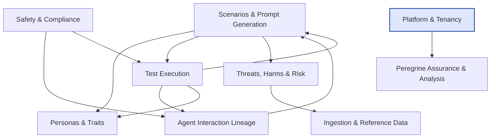

<!-- GENERATED FILE -- DO NOT EDIT BY HAND. -->
<!-- Regenerate: python3 scripts/generate_db_diagrams.py -->
<!-- Groupings: docs/diagrams/domains.json -->

# System Map

> The nine functional areas of the database and the main relationships between them. Every area is also scoped by Platform & Tenancy (highlighted); those universal links are omitted here for clarity — see [Tenancy & Isolation](11_tenancy_isolation.md).

