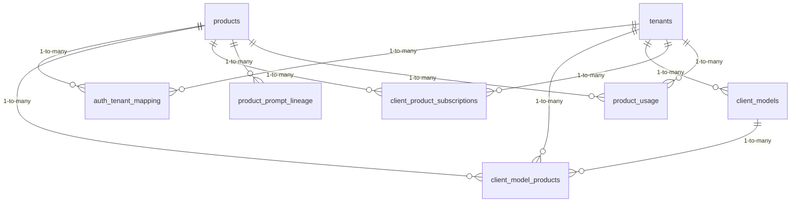

<!-- GENERATED FILE -- DO NOT EDIT BY HAND. -->
<!-- Regenerate: python3 scripts/generate_db_diagrams.py -->
<!-- Groupings: docs/diagrams/domains.json -->

# Platform & Tenancy

> The foundation every other area sits on: the customers (tenants), the products they subscribe to, and the AI models they bring for testing. Every record elsewhere is tagged with a product and tenant so data stays separated.

**Connects to:** Peregrine Assurance & Analysis
