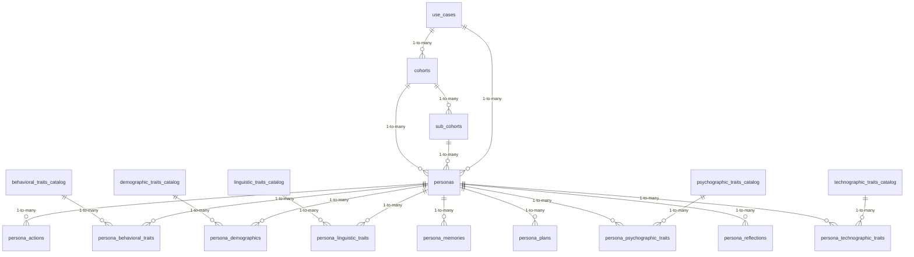

<!-- GENERATED FILE -- DO NOT EDIT BY HAND. -->
<!-- Regenerate: python3 scripts/generate_db_diagrams.py -->
<!-- Groupings: docs/diagrams/domains.json -->

# Personas & Traits

> Synthetic user profiles used to probe an AI model. Each persona is built from reusable trait catalogs (behavioral, demographic, linguistic, psychographic, technographic) and grouped into cohorts and use cases.

_Self-contained area (only linked to Platform & Tenancy)._
