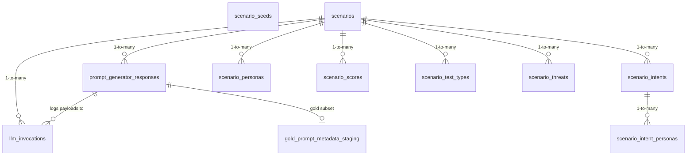

<!-- GENERATED FILE -- DO NOT EDIT BY HAND. -->
<!-- Regenerate: python3 scripts/generate_db_diagrams.py -->
<!-- Groupings: docs/diagrams/domains.json -->

# Scenarios & Prompt Generation

> The test situations and the prompts that come from them. Scenarios combine personas, intents and threats, then drive prompt generation and the LLM calls that produce candidate prompts.

**Connects to:** Personas & Traits, Test Execution, Threats, Harms & Risk
