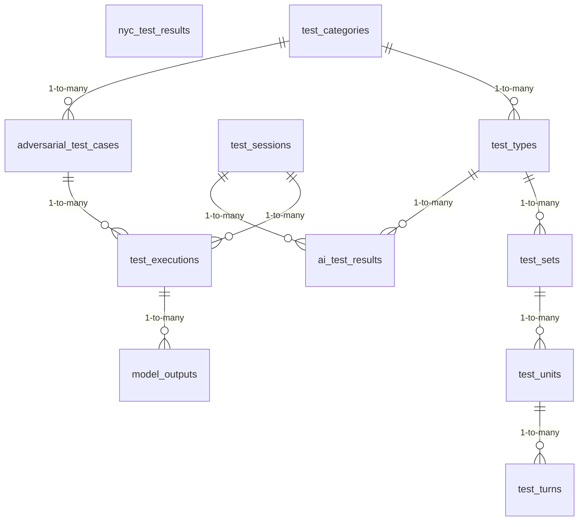

<!-- GENERATED FILE -- DO NOT EDIT BY HAND. -->
<!-- Regenerate: python3 scripts/generate_db_diagrams.py -->
<!-- Groupings: docs/diagrams/domains.json -->

# Test Execution

> Running tests against a customer's model and recording what happened: test sessions, the individual executions, the model's outputs, and the structured test catalog (categories, types, sets, units, turns).

**Connects to:** Agent Interaction Lineage, Personas & Traits, Scenarios & Prompt Generation
