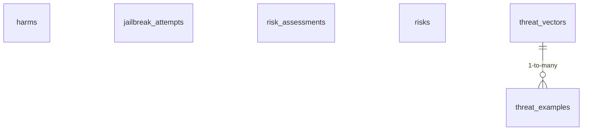

<!-- GENERATED FILE -- DO NOT EDIT BY HAND. -->
<!-- Regenerate: python3 scripts/generate_db_diagrams.py -->
<!-- Groupings: docs/diagrams/domains.json -->

# Threats, Harms & Risk

> The library of things that can go wrong and how risky they are: threat vectors and examples, harms, jailbreak attempts, and the risk assessments that weigh them.

**Connects to:** Ingestion & Reference Data
