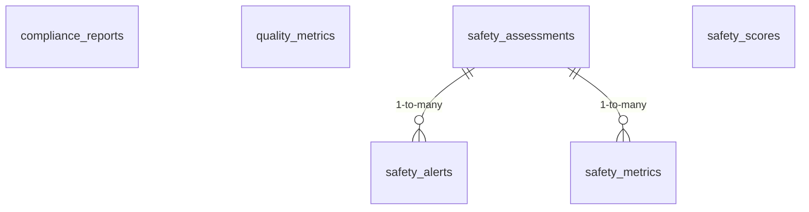

<!-- GENERATED FILE -- DO NOT EDIT BY HAND. -->
<!-- Regenerate: python3 scripts/generate_db_diagrams.py -->
<!-- Groupings: docs/diagrams/domains.json -->

# Safety & Compliance

> The scoring and reporting layer: safety assessments of model outputs, the alerts and metrics they raise, plus compliance reports and quality metrics for stakeholders and auditors.

**Connects to:** Agent Interaction Lineage, Test Execution
