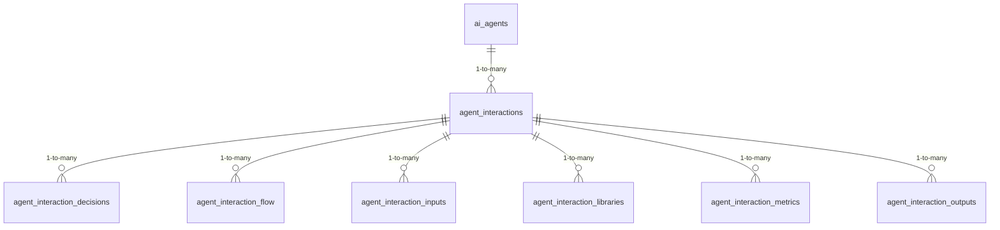

<!-- GENERATED FILE -- DO NOT EDIT BY HAND. -->
<!-- Regenerate: python3 scripts/generate_db_diagrams.py -->
<!-- Groupings: docs/diagrams/domains.json -->

# Agent Interaction Lineage

> A full audit trail of what the autonomous testing agents did: each interaction with its inputs, outputs, decisions, metrics, libraries used, and how interactions flow into one another.

**Connects to:** Scenarios & Prompt Generation
