<!-- GENERATED FILE -- DO NOT EDIT BY HAND. -->
<!-- Regenerate: python3 scripts/generate_db_diagrams.py -->
<!-- Groupings: docs/diagrams/domains.json -->

# Peregrine Assurance & Analysis

> The Peregrine deep-analysis engine: conversations and turns, generation runs and telemetry, the prompt library, embeddings and dimensionality-reduction models, plus benchmark, consistency, robustness and sycophancy analyses.

```mermaid
erDiagram
    analysis_results {
    }
    conversation_embeddings {
    }
    conversation_metrics {
    }
    model_metadata {
    }
    peregrine_audit_logs {
    }
    peregrine_benchmark_results {
    }
    peregrine_benchmark_runs {
    }
    peregrine_consistency_results {
    }
    peregrine_conversations {
    }
    peregrine_embeddings {
    }
    peregrine_generation_runs {
    }
    peregrine_pca_models {
    }
    peregrine_prompt_library {
    }
    peregrine_prompt_submissions {
    }
    peregrine_telemetry {
    }
    peregrine_turns {
    }
    peregrine_vectors_2d {
    }
    risk_metrics {
    }
    robustness_analysis {
    }
    sycophancy_events {
    }
    turn_embeddings {
    }
    peregrine_pca_models ||--o{ peregrine_turns : "1-to-many"
    peregrine_pca_models ||--o{ peregrine_vectors_2d : "1-to-many"
    peregrine_prompt_submissions ||--o{ peregrine_prompt_library : "1-to-many"
```

_Self-contained area (only linked to Platform & Tenancy)._
