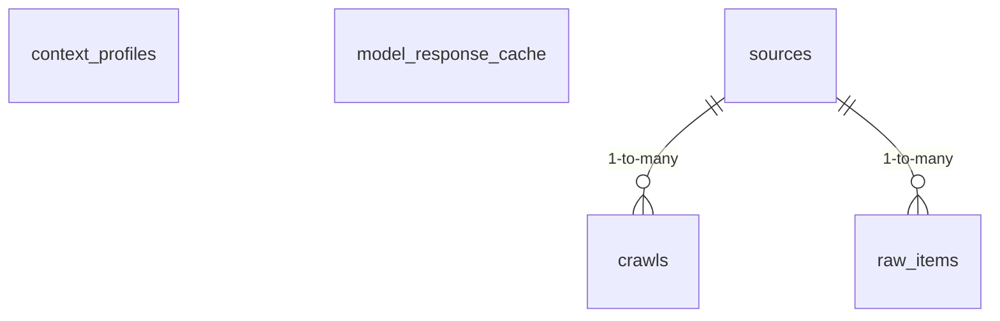

<!-- GENERATED FILE -- DO NOT EDIT BY HAND. -->
<!-- Regenerate: python3 scripts/generate_db_diagrams.py -->
<!-- Groupings: docs/diagrams/domains.json -->

# Ingestion & Reference Data

> Supporting data feeds and shared reference data: external content sources and crawls, raw collected items, deployment-context profiles, and a cache of model responses.

_Self-contained area (only linked to Platform & Tenancy)._
