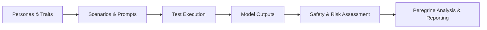

<!-- GENERATED FILE -- DO NOT EDIT BY HAND. -->
<!-- Regenerate: python3 scripts/generate_db_diagrams.py -->
<!-- Groupings: docs/diagrams/domains.json -->

# Data Lifecycle

> How information flows through one round of testing, from defining who we simulate to the final analysis a stakeholder reads.

