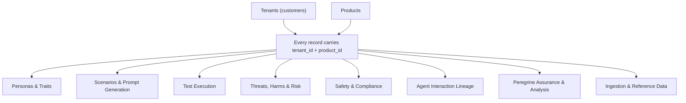

<!-- GENERATED FILE -- DO NOT EDIT BY HAND. -->
<!-- Regenerate: python3 scripts/generate_db_diagrams.py -->
<!-- Groupings: docs/diagrams/domains.json -->

# Tenancy & Isolation

> How customer data is kept separate. Tenants and products form a boundary: every record in every area is tagged with both, so one customer's data is never mixed with another's.

